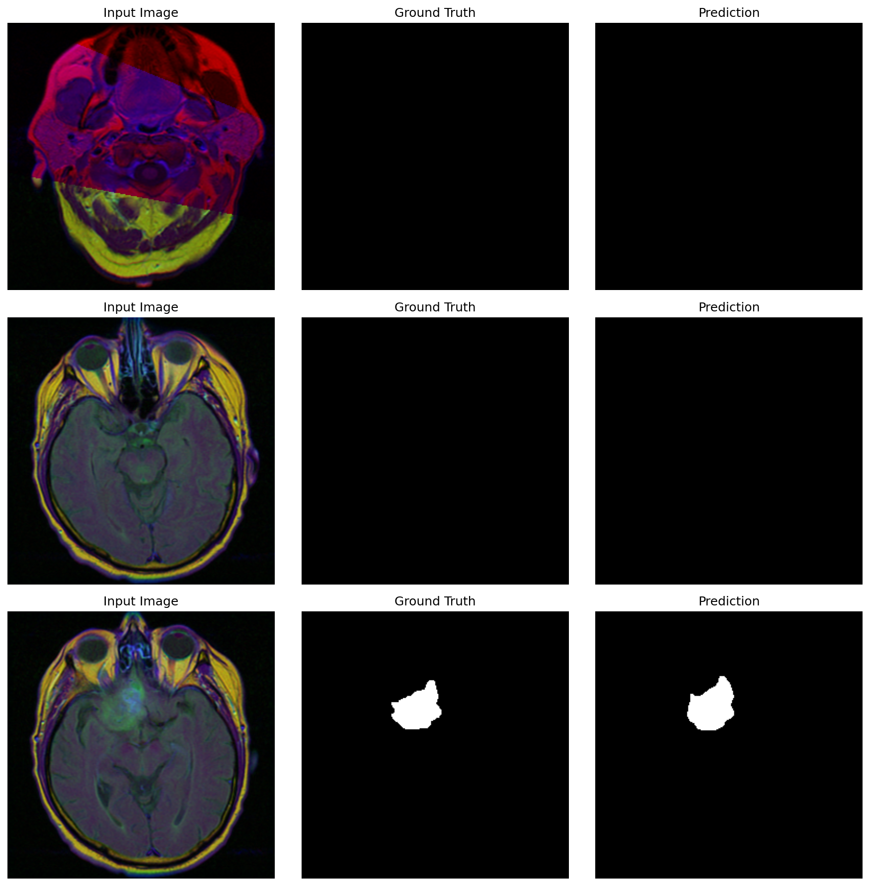

# Brain Tumor Segmentation using U-Net

Deep learning model for automatic brain tumor segmentation from MRI scans using U-Net architecture with transfer learning.



## 🎯 Project Overview

This project implements a U-Net convolutional neural network for semantic segmentation of brain tumors in MRI images. The model uses a pretrained ResNet50 encoder for improved feature extraction and achieves strong performance on the LGG MRI Segmentation dataset.

## 📊 Results

| Training Method | Validation Dice Score | Test Dice Score |
|----------------|----------------------|----------------|
| Training from Scratch | 38.7% | 40.0% |
| **With Pretrained ResNet50** | **58.9%** | **60.0%** |

The model demonstrates a **52% relative improvement** when using transfer learning with ImageNet-pretrained weights, highlighting the effectiveness of this approach for medical image segmentation tasks.

## 🏗️ Architecture

- **Model**: U-Net with ResNet50 encoder
- **Encoder**: ResNet50 (pretrained on ImageNet)
- **Decoder**: Standard U-Net upsampling path with skip connections
- **Loss Function**: Dice Loss
- **Optimizer**: Adam (lr=1e-4)
- **Input Size**: 256×256×3 (RGB MRI images)
- **Output**: 256×256×1 (binary segmentation mask)

## 📁 Dataset

**LGG MRI Segmentation Dataset** from Kaggle
- **Source**: The Cancer Imaging Archive (TCIA)
- **Size**: 110 patients with lower-grade glioma
- **Total Images**: 3,929 MRI slices
- **Format**: 3-channel TIFF images (pre-contrast, FLAIR, post-contrast)
- **Labels**: Binary masks (tumor vs. background)

**Data Split:**
- Training: 76 patients (73%)
- Validation: 17 patients (15%)
- Test: 17 patients (13%)

*Note: Patient-level splitting prevents data leakage between sets*

## 🚀 Training Details

**Data Augmentation:**
- Horizontal & Vertical Flips
- Random 90° Rotations
- Affine Transformations (scaling, translation, rotation)
- ImageNet Normalization

**Hardware:**
- Trained on Northeastern University's Explorer HPC cluster
- GPU: NVIDIA Tesla V100 (32GB)
- Training Time: ~20 minutes per run (20 epochs)

**Hyperparameters:**
- Batch Size: 16
- Epochs: 20
- Learning Rate: 1e-4
- Number of Workers: 4

## 📂 Project Structure
```
brain-tumor-segmentation-unet/
├── src/
│   ├── __init__.py
│   └── dataset.py              # Custom PyTorch Dataset
├── scripts/
│   └── train_gpu.sh            # HPC job submission script
├── notebooks/
│   ├── exploration.ipynb       # Data exploration
│   └── train_pipeline.ipynb    # Training experiments
├── logs/                       # Training logs
├── train.py                    # Main training script
├── evaluate.py                 # Model evaluation script
├── requirements.txt            # Python dependencies
└── README.md
```

## 🛠️ Installation
```bash
# Clone the repository
git clone https://github.com/YOUR_USERNAME/brain-tumor-segmentation-unet.git
cd brain-tumor-segmentation-unet

# Create virtual environment
python3 -m venv venv
source venv/bin/activate  # On Windows: venv\Scripts\activate

# Install dependencies
pip install -r requirements.txt
```

## 📥 Data Setup

1. Download the dataset from [Kaggle](https://www.kaggle.com/datasets/mateuszbuda/lgg-mri-segmentation)
2. Extract to `data/mri-segmentation/kaggle_3m/`

## 🎓 Training

**Local Training:**
```bash
python train.py
```

**HPC Training:**
```bash
# On HPC cluster
sbatch scripts/train_gpu.sh

# Monitor job
squeue -u $USER
tail -f logs/train_<JOB_ID>.out
```

## 📊 Evaluation
```bash
python evaluate.py
```

This will:
- Load the trained model (`best_model.pth`)
- Evaluate on the test set
- Generate visualization of predictions
- Save results to `predictions.png`

## 🔑 Key Learnings

1. **Transfer Learning Impact**: Pretrained weights improved performance by 20 percentage points (40% → 60% Dice score)
2. **Patient-Level Splitting**: Essential to prevent data leakage in medical imaging
3. **Data Augmentation**: Critical for small medical datasets to improve generalization
4. **HPC Utilization**: Enabled rapid experimentation with GPU acceleration

## 📈 Future Improvements

- [ ] Train for more epochs (50-100)
- [ ] Experiment with attention mechanisms (Attention U-Net)
- [ ] Try different encoders (EfficientNet, Vision Transformers)
- [ ] Implement ensemble models
- [ ] Add post-processing (morphological operations)
- [ ] Deploy as web application

## 📚 Dependencies
```
torch>=2.0.0
torchvision>=0.15.0
segmentation-models-pytorch>=0.3.3
albumentations>=1.3.0
opencv-python>=4.8.0
scikit-learn>=1.3.0
matplotlib>=3.7.0
numpy>=1.24.0
tqdm>=4.65.0
```

## 🎯 Use Cases

- Automated tumor detection in clinical settings
- Medical imaging research
- Computer-aided diagnosis systems
- Educational tool for deep learning in healthcare

## 📝 References

- **U-Net Paper**: Ronneberger et al., "U-Net: Convolutional Networks for Biomedical Image Segmentation" (2015)
- **Dataset**: Mateusz Buda et al., "Association of genomic subtypes of lower-grade gliomas with shape features automatically extracted by a deep learning algorithm" (2019)
- **Library**: [Segmentation Models PyTorch](https://github.com/qubvel/segmentation_models.pytorch)

## 👤 Author

**Atharva Dhumal**
- GitHub: [@atharvadhumal03](https://github.com/YOUR_USERNAME)


## 🙏 Acknowledgments

- Northeastern University's Research Computing team for HPC access
- The Cancer Imaging Archive (TCIA) for the dataset
- Pavel Yakubovskiy for the segmentation_models_pytorch library

---

**⭐ If you find this project helpful, please consider giving it a star!**